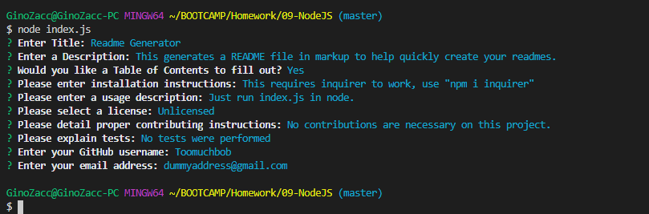

 
# Readme Generator
### Table of contents 
* [Description](#Description) 
* [Installation](#Installation) 
* [Usage](#Usage) 
* [Contributing](#Contributing) 
* [Tests](#Tests) 
* [Questions](#Questions) 
## Description 
This generates a README file in markup to help quickly create your readmes.
### Installation 
This requires inquirer to work, use "npm i inquirer"
### Usage 
Just run index.js in node.

#### Contributing 
No contributions are necessary on this project.
#### Tests 
No tests were performed
#### Questions 
 [Github](https://github.com/Toomuchbob)
 
Please email me with any questions at: dummyaddress@gmail.com
